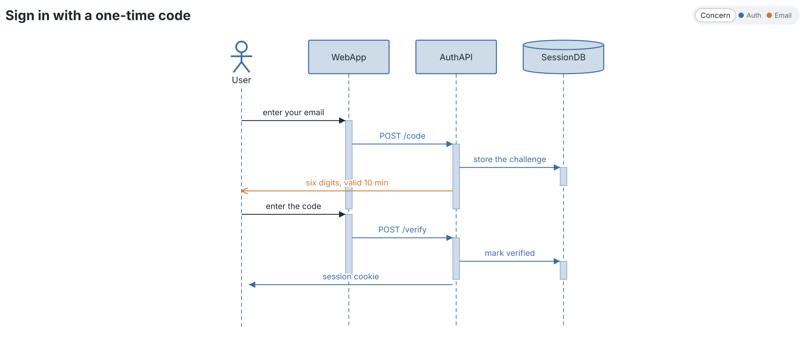

  

  Rendered from <a href="https://github.com/diagrammo/.github/blob/main/profile/hero.dgmo">its DGMO source</a> by <a href="https://github.com/diagrammo/.github/blob/main/.github/workflows/render-hero.yml">a job that re-renders it</a> — so it never falls behind the renderer.

# Diagrammo

**Simple text in. Brilliant diagrams out.**

Author diagrams as code with the DGMO language. Render to SVG/PNG. Use it in the desktop app, the web editor, your editor of choice, your docs, your scripts, or with AI.

[**Get Diagrammo**](https://diagrammo.app/start) · [Try in browser](https://online.diagrammo.app) · [Docs](https://diagrammo.app/docs) · [Compare](https://diagrammo.app/compare)

## Where to use it

| | |
|---|---|
| **Desktop app** | macOS app with live preview, file tree, exports — [diagrammo.app](https://diagrammo.app/start) |
| **Web editor** | Full editor in the browser — [online.diagrammo.app](https://online.diagrammo.app) |
| **CLI** | `dgmo render foo.dgmo` — [dgmo](https://github.com/diagrammo/dgmo) |
| **Obsidian** | `.dgmo` blocks render in your notes — [obsidian-dgmo](https://github.com/diagrammo/obsidian-dgmo) |
| **VS Code** | `.dgmo` file preview — [vscode-dgmo](https://github.com/diagrammo/vscode-dgmo) |
| **Astro** | Render diagram blocks at build time — [astro-dgmo](https://github.com/diagrammo/astro-dgmo) |
| **MCP** | Generate and render diagrams from Claude, Cursor, Windsurf — [dgmo-mcp](https://github.com/diagrammo/dgmo-mcp) |
| **Homebrew** | `brew install diagrammo/dgmo/dgmo` — [homebrew-dgmo](https://github.com/diagrammo/homebrew-dgmo) |

## What you can render

35+ chart types — flowcharts, sequence, gantt, kanban, ER, class, C4, org, infrastructure, sitemaps, sankey, treemap, sunburst, radar, slope, arc, timeline, wordcloud, venn, quadrant, and more.

[See it in action →](https://diagrammo.app)
